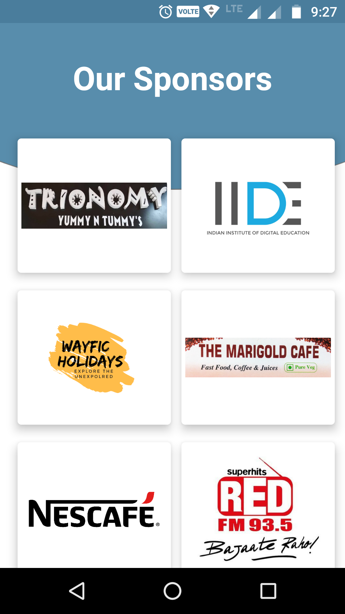

#SynTech-X

SynTech-X App is an android application for the Intercollegiate Festival SynTech-X organized by the Computer Science Department of  R D National College for the academic year 2018-19.
App keeps users up to date about the events, participants can view event details, register online, call Event Heads for any queries, get notification about the upcoming event.

&nbsp;&nbsp;&nbsp;&nbsp;&nbsp;&nbsp;

&nbsp;&nbsp;&nbsp;&nbsp;&nbsp;&nbsp;

&nbsp;&nbsp;&nbsp;&nbsp;&nbsp;&nbsp;

&nbsp;&nbsp;&nbsp;&nbsp;&nbsp;&nbsp;

&nbsp;&nbsp;&nbsp;
